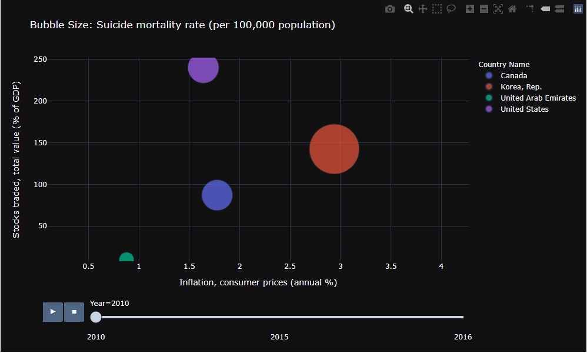
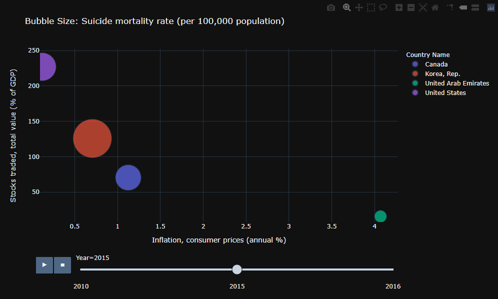

## What is it that you are investigating/exploring/analyzing (provide sufficient background information)?
### My project will focus on the Financial sector for the years 2010-2019. Mainly on the number of stocks traded, the percent change of the S&P Global Equity Indices, and the percent of inflation in consumer prices. 

## Why is it important to you and/or to others?
### Numerous factors affect the financial sector and the stock market. I will be comparing the annual percentage of inflation (consumer prices) for both the United States (North America) and South Korea (East Asia & Pacific). These factors include presidential regimes, the global pandemic, and regional crises (i.e. housing crash of '08). 

## What questions do you have in mind and would like to answer?
### Does the volume of stocks being traded or the stability of the S&P Global Equity Indices give any prediction on the level of inflation?
### Can deflation or inflation be predicting factors on the stock market?
### Does inflation/deflation and the stock market have a correlation of the suicide rate?

## Where do you get the data to help answer your questions?
### All data and information would be coming from the World Development Indicators (WDI - http://www.worlddev.xyz/) 
### The WDI is a cross-country analytical tool that provides data on 1400+ socioeconomic indicators of 200+ countries over the span of 50+ years. It's primary datasource is the World Bank.
### The World Development Explorer (WDX) allows users to interact with the WDI on a click & play type of interface. The unique feature of the WDX is the incorporation of Hofestede's Cultural Dimensions which allows users to view how culture affects socioeconomic factors. 

## What process/step you use to analyze the situation/issue
### For this part of the project, I will be utilizing the various graphs from the world development website (www.worlddev.xyz)

## Suicide rate in 2010 for the 4 Countries based on Stocks Traded & the S&P Global Equity Indices

### This bubble chart allows for the visualization of the suicide mortality rate by the size of the bubble. The larger the bubble, the higher the suicide mortality rate. We can see that the USA has the highest volume of stocks traded (% of GDP) in 2010 and has a moderate level of suicide mortality rate. In comparison, the United Emirates has lowest volume of stocks traded with a very low amount of suicide mortality rate. I would like to focus on South Korea which seemingly has a moderate level of stocks traded and a very large level of suicide rates. 

### Looking at the same variables, we are able to visualize the changes across a five year span. The variablity of change in suicide mortality rates seem to be the same. South Korea is once again the largest bubble signifying the highest rate of suicide. The USA and United Emirates have the highest and lowest (respectively) volume of stocks traded. Inflation does not seem to affect suicide rates.

## Inflation Across the Years 2010 - 2018

### Using a line graph provides an excellent visualization of the changes in inflation over the years. Focusing on South Korea (which was shown to have the highest suicide mortality rates in both 2010 and 2015), we can see that the inflation rate decreases from 3% in 2010 to 0.75% in 2015. Notably, the United States also has a drastic change in inflation rates from 0.9% in 2010 to 2.6% in 2015. 

## Foreign Direct Investments (Net Outflows) Across the Years 2010-2019

### Other than the United States, the three other countries seems to have a flat line in net outflows during the years selected. The United States shows a steady decrease throughout the years.

## S&P 500 Global Equity Indices 2010-2015

### Analyzing the stock market directly with the S&P 500 Global Equity Indices, we can see that South Korea and Canada both show high levels of annual percent change. 

### When viewing the same metrics in 2015, all four countries have negative percent changes with Canada and the United Emirates showing the greatest change. 
